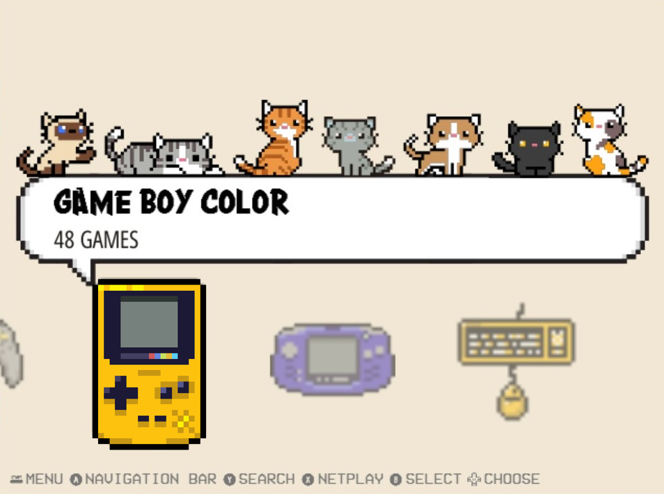
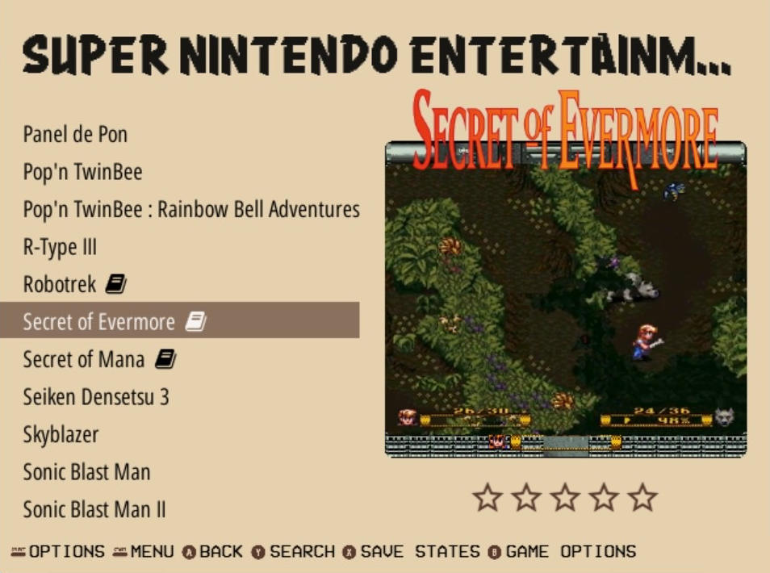
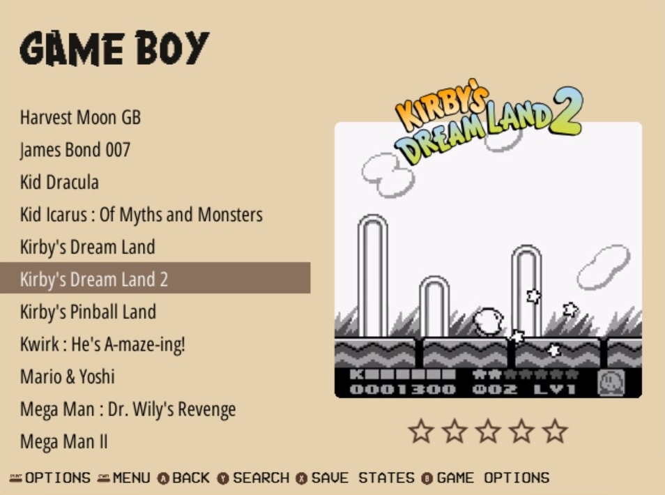

# Contents

- [About](#about)
- [Disclaimers](#disclaimers)
- [Screenshots](#screenshots)
- [License](#license)
- [Made With](#made-with)

# About
The Pixel Perfect theme was designed exclusively for the retro handheld console R36S, running ArkOS (It may work in other specifications but it may need adaptations). 

 

# Disclaimers
- I cannot give support for this theme, what I did here was modify an existing theme to my liking, create some coding with the basic knowledge of xml that I have, and make things work for how I was interested in. I do not garantee that it will work perfectly for you. I simply changed and adapted the aspects that I wanted. 
- I didn't crteate icons for every single system supported, but I created/found icons for the major and most popular ones, so most people will be fine with the ones provided. You can always add the ones that are not there yet if you find some in the same style.
- Dark mode is not working, I have no idea why YET (as I said, I have basic knowledge and just managed to get my way around it), but I'll keep trying. You're welcome to solve it =) 
- If you have any questions I may not be able to answer them since I am not well versed on creating themes for Emulation Station. I will be happy to try but I can't garantee any solutions =)
- Suggestions, inputs and contributions are appreciated.

# Screenshots

# License

All [videogame and computer system logos](./assets/logos/) used are the property of their respective Developers/Producers/Distributors/Licensors.

Some logos were taken from [Starvingartist's (Stanley Sy) Antiseptic Videogame Icons Pack](https://iconarchive.com/show/antiseptic-videogame-icons-by-starvingartist.html#google_vignette). 

The [fonts](./assets/fonts/) are free from [dafont.com](www.dafont.com).

All the files, code and images not mentioned above are licensed under the [MIT License](./LICENSE).

 

# Made With

